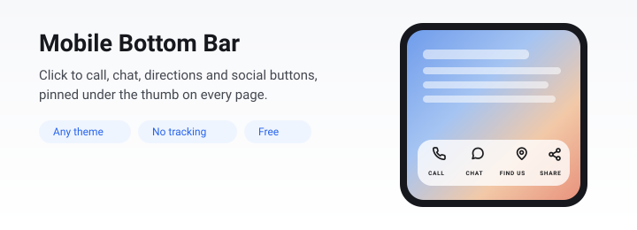

<div align="center">



# DiceBar — Mobile Bottom Bar, Click to Call &amp; Chat for WordPress

**A sticky bottom bar for phones. Click to call, chat, directions and social icons. Free, no tracking, works with any theme.**

[](https://wordpress.org/plugins/dicebar/)
[](https://wordpress.org/)
[](https://www.php.net/)
[](LICENSE)
[](https://wordpress.org/plugins/plugin-check/)

[Documentation](https://dicecodes.com/dicebar-wordpress-plugin/) ·
[Download](https://wordpress.org/plugins/dicebar/) ·
[Report a bug](https://github.com/IamRamgarhia/dicebar/issues)

</div>

---

## What it does

Most visitors arrive on a phone. On a phone, a phone number in the footer is four
scrolls away and a contact form is a wall.

**DiceBar** adds a fixed bar across the bottom of the screen holding the
buttons people actually need: a **click to call button**, a **WhatsApp chat
button**, **directions**, email, social profiles, or a link to anywhere on your
site. It works with any WordPress theme and any page builder.

Every feature listed here is in the free plugin. There is no locked tier, no
advert in your dashboard, and no tracking of any kind.

## Features

| | |
|---|---|
| **Click to call button** | Taps straight into the dialler |
| **WhatsApp button** | Opens a chat, optionally with a message already written |
| **SMS and email buttons** | With a prefilled body or subject |
| **Directions button** | Opens the map app with your address searched |
| **Social profile buttons** | Thirty networks, optionally in their own brand colours |
| **Link, page, anchor, share, back to top** | The rest of what a bar needs |
| **Four looks** | Glass, solid, minimal and bold, with adjustable blur and transparency |
| **Icons, words, or both** | A whole-bar choice, for a reason explained below |
| **Nine starter kits** | Restaurant, clinic, trade, shop, blog, portfolio, social, and more |
| **Live preview** | The real bar, on a photograph, light or dark, at 320, 375 and 414 px |
| **Shortcode and Elementor widget** | Put the same row inside any page |
| **Cache-safe** | Designed for full-page caching rather than patched for it |

## Install

From your dashboard, search for **DiceBar** under Plugins, then Add New.

Or with WP-CLI:

```bash
wp plugin install dicebar --activate
```

Requires WordPress 6.0 or newer and PHP 7.4 or newer. No other dependencies, and
no external requests at any point.

## Use it inside a page

The bar appears by itself. To also show the same row of buttons in your content:

```
[dicebar]
```

To show only some buttons, name them by id:

```
[dicebar items="itm_a1b2c3d4, itm_e5f6a7b8"]
```

The shortcode works in the block editor, in widgets, in theme templates, and in
**Elementor, Divi, Beaver Builder, Bricks and Oxygen**. Elementor users also get
a DiceBar widget in the panel, registered only when Elementor is
actually loaded.

## Why it works with caching

A full-page cache stores one copy of a page and serves it to everybody, which
quietly breaks any rule that differs between two visitors at the same address.
The plugin splits its rules by kind:

| Rule | Worked out | Why |
|---|---|---|
| Which page | On the server | Varies with the address, so a cache keyed on the address is correct |
| Screen width | In CSS | The browser re-evaluates on rotation for free |
| Signed in or out | In the browser | Differs between two visitors at the same address |

The front-end script also carries the opt-out attributes WP Rocket, LiteSpeed,
Autoptimize and Rocket Loader respect, because deferring a script that decides
what a visitor sees shows the wrong thing first.

## Tracking taps, without the plugin tracking anything

Nothing is collected and nothing is sent anywhere. A tap does fire an event
inside the page so your own analytics can listen for it:

```js
document.addEventListener( 'dicebar:click', function ( event ) {
	window.dataLayer = window.dataLayer || [];
	window.dataLayer.push( {
		event: 'footer_bar_click',
		button: event.detail.type
	} );
} );
```

## Extending it

| Filter | Changes |
|---|---|
| `dicebar_item_types` | Register your own button type |
| `dicebar_icons` | Add or replace icons |
| `dicebar_presets` | Add your own starter kits |
| `dicebar_will_render` | Decide whether the bar renders on a request |
| `dicebar_z_index` | Change the stacking order in code |

```php
add_filter( 'dicebar_item_types', function ( $types ) {
	$types['booking'] = array(
		'label' => 'Booking',
		'icon'  => 'calendar',
		'value' => array( 'kind' => 'url', 'label' => 'Booking address' ),
		'extra' => array(),
	);

	return $types;
} );
```

Every value is also a CSS custom property on the wrapper, so a theme can override
anything without an `!important`:

```css
.dicebar {
	--dicebar-radius: 24px;
	--dicebar-accent: #e11d48;
}
```

## A few decisions, and why

**Four buttons is the cap.** At 320 px the bar has 288 px of usable width. Four
labelled buttons is 72 px each, which fits about eight characters. A fifth does
not shrink the words, it cuts them off. The plugin caps it and says why, rather
than letting you find out on a visitor's screen.

**Labels are all or none.** An unlabelled icon centres itself while a labelled one
lifts to make room. Mixing them leaves one mark sitting 10 px lower than its
neighbours for no reason anybody can see.

**Five link schemes, and no others.** Web, secure web, telephone, email and text
message. Everything else is rejected on save, including for administrators,
because administrator accounts get compromised and a script link in a button is
stored cross-site scripting.

**Dark colours are chosen, not derived.** An automatically inverted brand colour
is almost always wrong.

## Development

```bash
npm install && composer install
npm run env:rebuild     # Docker WordPress, from nothing, with retries
npm run test:php        # PHPUnit against a real WordPress
composer lint           # PHPCS, WordPress standards, PHP 7.4 compatibility
npm run check           # the official Plugin Check
npm run build:zip       # the distributable archive
npm run verify:zip      # unpack it the way WordPress does
```

`npm run version:set -- 1.7.0` writes the version to all four places that have to
agree. A test asserts they match, because a header and a readme stable tag that
disagree ship the wrong code with no warning.

## Contributing

Bug reports and pull requests are welcome. Please read
[CONTRIBUTING.md](CONTRIBUTING.md) first, and run `composer lint` and
`npm run test:php` before opening a pull request.

## License

GPL-2.0-or-later. See [LICENSE](LICENSE).

Built and maintained by [Dice Codes](https://dicecodes.com/).

---

<div align="center">

**Keywords:** WordPress click to call button · call now button plugin · mobile
bottom bar · sticky footer bar · WhatsApp chat button · floating action button ·
mobile menu bar · bottom navigation bar for WordPress · contact button plugin

</div>
